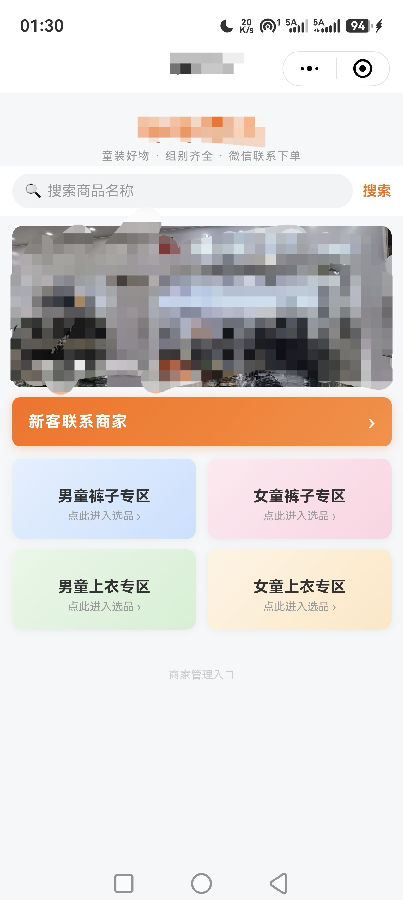
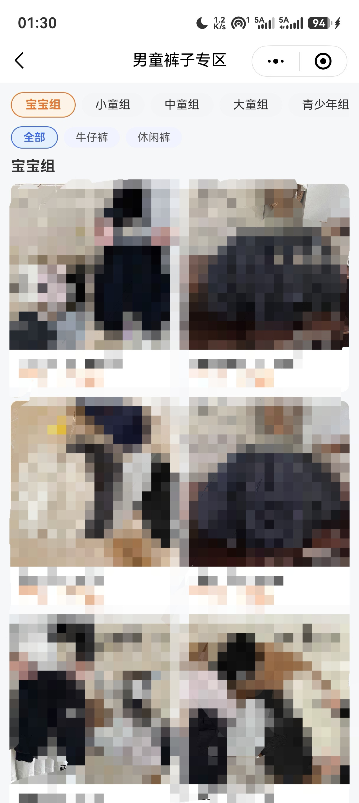
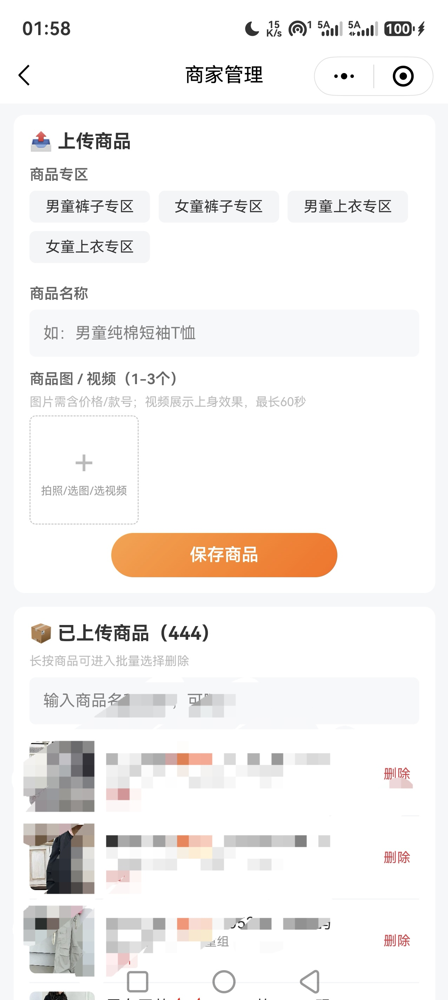

<div align="center">

# 服装图片展示小程序

**微信原生小程序 · 童装分类展示模板** —— 逛专区 → 看商品(图/视频) → 存原图 → 微信下单

纯前端微信小程序 + 云开发，**无自建服务器、无域名备案、无支付资质**，个人主体即可发布上线。

</div>

## 📱 界面预览

<p align="center">
  
  
  
</p>

> 左：首页（品牌标题 / 搜索 / 轮播宣传图 / 四大专区入口）
> 中：专区商品列表（组别 chips + 小分组筛选 + 图/视频混排卡片）
> 右：商家管理（手机端上传 / 搜索 / 删除商品）

## ✨ 为什么值得一看

| 亮点 | 说明 |
|------|------|
| 🧩 **三级分类体系** | 专区 → 组别 → 小分组，类目结构**纯配置驱动**（`utils/config.js`），改类目不动代码 |
| 🎨 **换品牌只改一个文件** | 品牌名/标语/轮播图/微信号全部收敛在 `config.js`，页面零写死 |
| 📱 **原生小程序，零框架依赖** | 无 npm 构建、无第三方 UI 库，微信开发者工具打开即跑 |
| ☁️ **云开发一键上线** | 云数据库 + 云存储 + 云函数，**免服务器免备案**，个人主体可发布 |
| 🔄 **双数据层策略切换** | `local`(单机演示) / `cloud`(云开发) 同签名实现，`api.js` 统一出口，切换数据源**页面代码零改动** |
| 🔐 **商家权限安全设计** | 管理端走 **openid 白名单**(admins 集合) + **更新字段白名单**，防越权防篡改 |
| 💰 **低成本运营** | 商家上传自动压缩图片(约 100-400KB/张)，控制云存储容量与流量费用 |
| 🧾 **合规好过审** | 无购物车/无订单/无在线支付，避开电商类目资质要求（个人主体可过） |

## 🎯 核心流程

```
用户: 首页四专区 → 组别小卡片 → 组内商品列表(图/视频混排)
     → 详情查看 → 保存商品原图(无附加信息) → 微信发给商家下单
商家: 首页底部"商家管理入口"(白名单/密码) → 选专区+组别+名称
     → 上传图片/视频(自动压缩) → 全用户实时可见, 仅商家可删
```

## 🏗️ 架构设计

```
┌─────────────────────────────────────────────────┐
│  pages/   index · products · detail · admin     │  ← 页面只依赖 api.js
└──────────────────────┬──────────────────────────┘
                       │ 同签名 Promise 接口
              ┌────────▼─────────┐
              │  services/api.js │  ← ★ 统一数据出口(策略分发)
              └────────┬─────────┘
        ┌──────────────┴──────────────┐
        │ DATA_SOURCE='local'         │ DATA_SOURCE='cloud'
┌───────▼────────┐           ┌────────▼──────────┐
│  mock.js       │           │  cloud.js         │
│  本机持久化存储 │           │  云开发(数据库/    │
│  (wx storage)  │           │   存储/云函数)     │
└────────────────┘           └────────┬──────────┘
                                      │ 写操作走云函数鉴权
                              ┌───────▼────────┐
                              │ admin 云函数    │
                              │ openid 白名单   │
                              └────────────────┘
```

**分层约定**：页面只 `require('../../services/api')`，永不直接触碰 `mock.js` / `cloud.js` /
云 API —— 想换数据源、加缓存、加统计，只动 services 层。

### 目录结构

```
├── miniprogram/
│   ├── app.js / app.json / app.wxss     # 全局
│   ├── pages/
│   │   ├── index/       # 首页: 品牌 + 搜索 + 轮播 + 专区入口卡片
│   │   ├── products/    # 专区页: 组别卡片 → 商品列表(图/视频混排)
│   │   ├── detail/      # 详情: 媒体预览 + 保存原图到相册
│   │   └── admin/       # 商家管理: 上传/删除/检索/批量归类
│   ├── components/
│   │   ├── search-bar/      # 商品名称搜索
│   │   └── product-card/    # 商品卡片(视频徽标, 双列网格)
│   ├── services/
│   │   ├── api.js       # ★ 统一数据出口(策略分发 local/cloud)
│   │   ├── mock.js      # local 实现: 本机持久化
│   │   └── cloud.js     # cloud 实现: 云开发(正式模式)
│   ├── utils/config.js  # ★ 品牌/专区/组别/数据源 唯一配置点
│   └── images/          # 首页轮播宣传图
├── cloudfunctions/
│   ├── admin/           # 商家操作统一入口(openid 白名单鉴权)
│   └── recordVisit/     # 用户访问自统计(控制台统计不可靠的替代方案)
├── DEPLOY.md            # 云开发部署指南(集合权限/云函数/白名单)
└── project.config.json
```

## 🚀 快速开始

**30 秒本地演示**（无需注册任何东西）：

1. 微信开发者工具 → 导入项目 → 选择本目录
2. AppID 选「测试号」，`utils/config.js` 的 `DATA_SOURCE` 改为 `'local'`
3. 编译运行：首页逛专区，底部「商家管理入口」设个密码即可体验商家上传

**正式上线**（个人主体可发布，约 10 分钟）：

1. mp.weixin.qq.com 注册小程序，拿到 AppID 填入 `project.config.json`
2. `utils/config.js` 的 `DATA_SOURCE` 改回 `'cloud'`
3. 开通云开发 → 建 `products` / `admins` 集合 → 部署两个云函数
4. 把自己的 openid 加进 `admins` 白名单
5. 上传代码 → 提交审核 → 发布

> 📖 详细图文步骤见 **[DEPLOY.md](DEPLOY.md)**

## 🎨 改成你自己的品牌 / 类目

全局只需要改 **`miniprogram/utils/config.js`** 一个文件：

```js
// 品牌信息
APP_NAME: '童装优选',          // 小程序名(导航栏/分享标题)
BRAND_NAME: '童装优选',        // 首页顶部品牌名
BRAND_SLOGAN: '童装好物 · 组别齐全 · 微信联系下单',
CONTACT_WECHAT: 'your-wechat-id',   // 联系商家微信号

// 首页轮播: 默认空(占位); 真实宣传图与联系微信写在 config.local.js
// (该文件不入库, 详见 config.js 文件末尾说明)
HOME_BANNERS: [],
```

> 再顺手把 `app.json` / `pages/index/index.json` 的 `navigationBarTitleText` 同步成你的品牌名即可。
> 类目结构同理：改 `ZONES`（当前为童装四专区示例：男/女童 × 裤/上衣，含组别与小分组三级）。

## 📦 数据模型

```js
{
  id: 'p123',          // 唯一 ID
  name: '男童纯棉短袖T恤',
  gender: 'boy',       // boy | girl（可扩展）
  part: 'top',         // top | pants
  group: '小童组',     // 二级类目
  subGroup: '牛仔裤',  // 三级类目(可选)
  media: [             // 1-3 个, 图/视频可混传
    { type: 'image', url: '...' },
    { type: 'video', url: '...', poster: '封面...' }
  ]
}
```

## 🔐 安全设计（商家端）

- **鉴权**：`admin` 云函数对每次调用做 `admins` 集合 **openid 白名单**校验（cloud 模式）；
  本地演示模式为首次自设密码（存本机，无硬编码默认密码）
- **防篡改**：批量更新只接受白名单字段 `name/gender/part/group/subGroup`，其余字段一律丢弃
- **权限最小化**：客户端直读商品集合，所有写操作强制走云函数（绕过客户端权限限制）
- **操作留痕**：云函数记录每次调用的 openid 与 action，便于排查
- **成本控制**：上传自动压缩（`compressed` 模式），2000 张约 0.5GB 而非原图 10GB

## 🧩 常见问题

| 问题 | 解决 |
|------|------|
| 管理页提示「无权限」 | 自己的 openid 还没加入 `admins` 集合（见 DEPLOY.md 第四节） |
| 商品列表为空 | `products` 集合权限需为「所有用户可读」；商家端是否已上传 |
| 想先本地玩 | `DATA_SOURCE: 'local'`，无需开通云开发 |
| 云函数报错 | 确认已在开发者工具中右键 `cloudfunctions/admin` → 上传并部署（云端安装依赖） |

## 🗺️ Roadmap

- [x] 云开发数据层（云存储 + 云数据库 + 云函数鉴权）
- [x] 三级分类（专区/组别/小分组）纯配置化
- [x] 品牌信息全量 config 化（开源模板化）
- [ ] 宣传图商家端可视化配置（当前为替换包内图片）
- [ ] 类目管理后台化（免改代码加专区）
- [ ] 分享卡片自定义海报生成

## 📄 License

[MIT](LICENSE) © 2026 [z8-ui](https://github.com/z8-ui)
